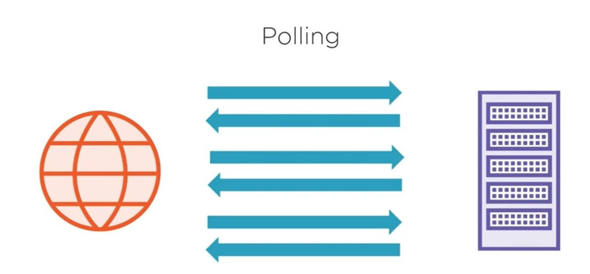
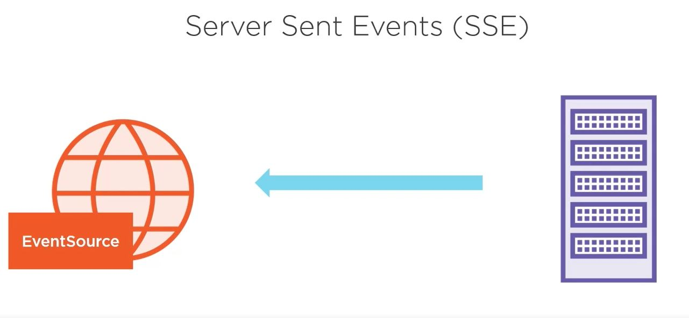
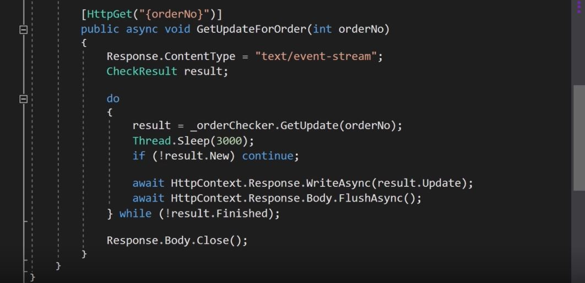
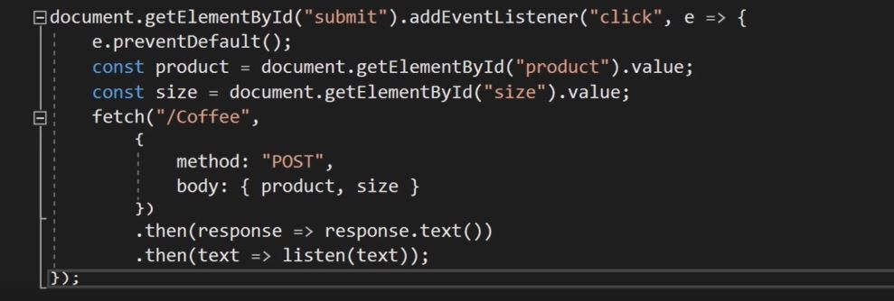
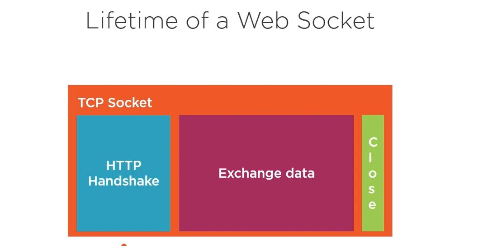
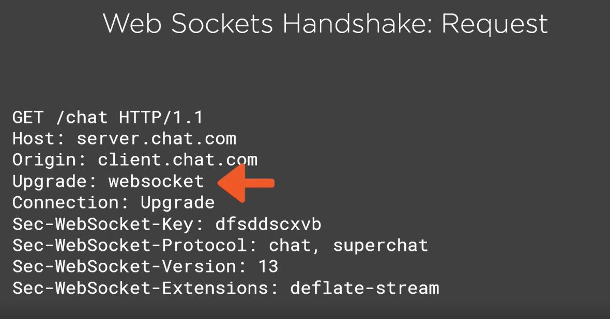
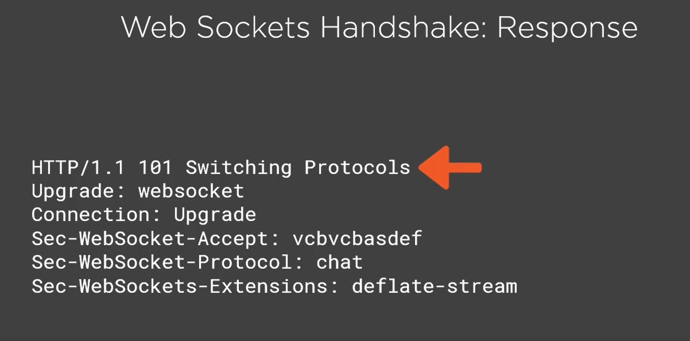

# AspCoreSignalR

    What are the method we have to call a server update with no post back?
        <ul>
            <li>Polling</li>
            <li>Long Polling</li>
            <li>Server Event</li>
            <li>WebSocket</li>
            <li>*Signal R*</li>
        </ul>
        

            <h3>Polling:</h3>
            In polling there will be multiple call to the server untile we get the result.
                    
            <pre>
                function doPoll(){
                    fetch('http://Sample/getresult', 
                    {
                        method: "POST",
                        body:{product, size};
                    })
                    .then(response = &gt; response.text())
                    .then(id =&gt; intervarId = setInterval(doPoll, 1000, id));
                });
            </pre>
            here untie we get the repy from server we keep on calling the url.
        

        

            <h3>Long Polling</h3>
            We request the server and server will keep open the connection until respond to the request, If there is no response within certain timeframe the request will timeout. If timeout happen browser will start requesting again with new request.
            
            <b>Server Side Code</b>
            
            <b>Client Side Code</b>
            
        

        

            <h3>Server Sent Events</h3>
            It is consider html5 feature.
            Server create http connection to the browser with Server Sent Event. Broswer will listen to the incomming message as stream and connection will remain open untile it actively close.
             
            Server Side Code looks like below
             
            Client side code looks like below
             
            we can can upto 6 open connections to a browser. It support text and binary messages.
        

        

            <h3>Web Sockets</h3>
            A standardized way to use one TCP socket through which messages can be sent from server to client and vice versa. TCP connection will be opne as long as the stream of message are done. SignalR uses Web socket most of the time when upto the browser. It supports Full duplex messaging and allowed 50 connections to a browser.
            It support many different data type (text, Binary, Audio, Video).
            
             
            <u>Web Sockets Handshake</u> 
             <ol>
                <li>Browser makes get http call to server to request an upgrate to http socket</li>
                <li>If server accept this socket become web socket and ready to sent messages.
                Request : 
                Response:
                </li>
             </ol>
        

        

            <h3><b>SignalR</b></h3>
            Test Text
        

