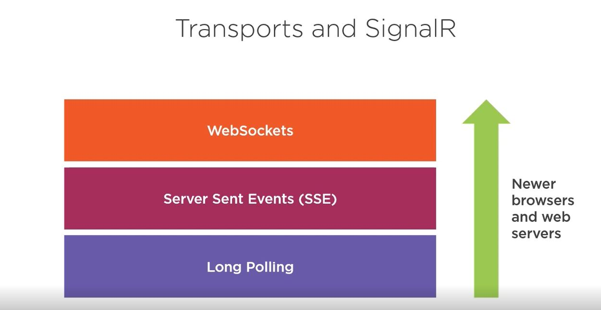
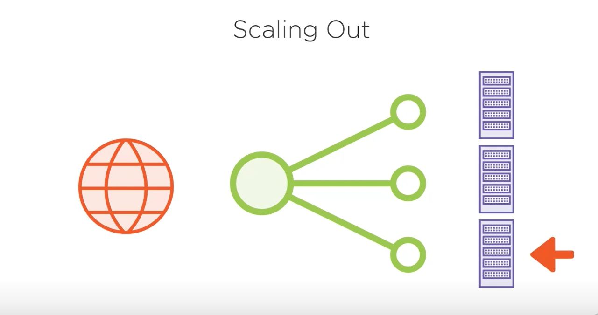
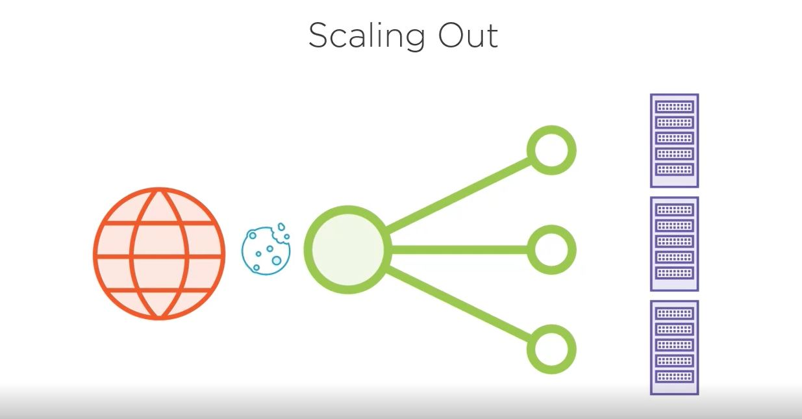
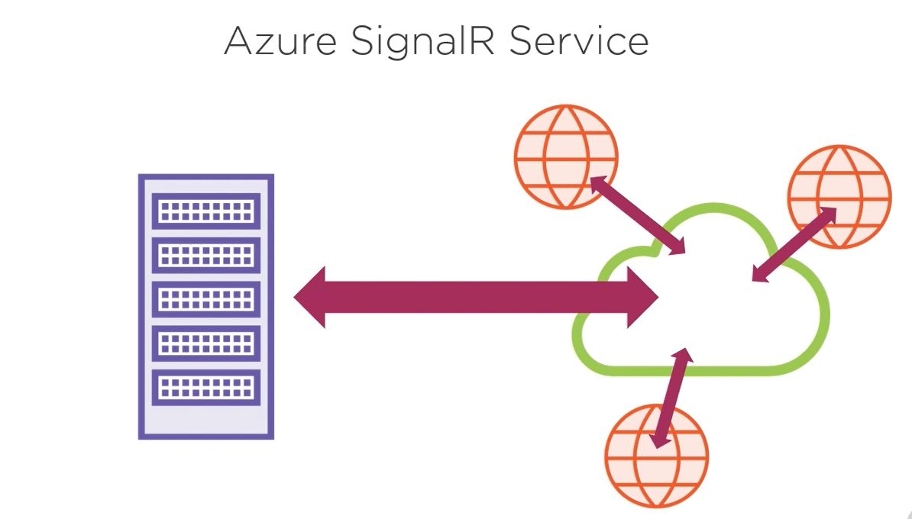
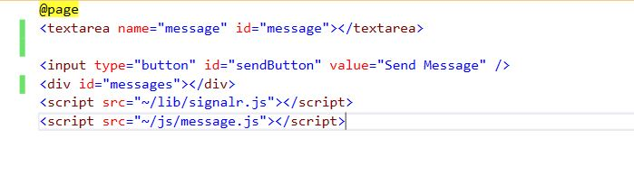
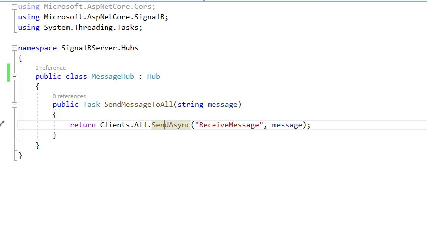
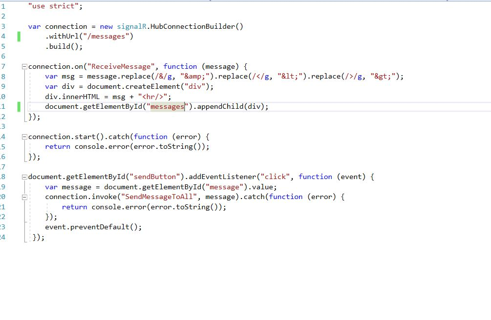

# AspCoreSignalR

    What are the method we have to call a server update with no post back?
        <ul>
            <li>Polling</li>
            <li>Long Polling</li>
            <li>Server Event</li>
            <li>WebSocket</li>
            <li>*Signal R*</li>
        </ul>
        

            <h3>Polling:</h3>
            In polling there will be multiple call to the server untile we get the result.
                    
            <pre>
                function doPoll(){
                    fetch('http://Sample/getresult', 
                    {
                        method: "POST",
                        body:{product, size};
                    })
                    .then(response = &gt; response.text())
                    .then(id =&gt; intervarId = setInterval(doPoll, 1000, id));
                });
            </pre>
            here untie we get the repy from server we keep on calling the url.
        

        

            <h3>Long Polling</h3>
            We request the server and server will keep open the connection until respond to the request, If there is no response within certain timeframe the request will timeout. If timeout happen browser will start requesting again with new request.
            
            <b>Server Side Code</b>
            
            <b>Client Side Code</b>
            
        

        

            <h3>Server Sent Events</h3>
            It is consider html5 feature.
            Server create http connection to the browser with Server Sent Event. Broswer will listen to the incomming message as stream and connection will remain open untile it actively close.
             
            Server Side Code looks like below
             
            Client side code looks like below
             
            we can can upto 6 open connections to a browser. It support text and binary messages.
        

        

            <h3>Web Sockets</h3>
            A standardized way to use one TCP socket through which messages can be sent from server to client and vice versa. TCP connection will be opne as long as the stream of message are done. SignalR uses Web socket most of the time when upto the browser. It supports Full duplex messaging and allowed 50 connections to a browser.
            It support many different data type (text, Binary, Audio, Video).
            
             
            <u>Web Sockets Handshake</u> 
             <ol>
                <li>Browser makes get http call to server to request an upgrate to http socket</li>
                <li>If server accept this socket become web socket and ready to sent messages.
                Request : 
                Response:
                </li>
             </ol>
        

        

            <h3><b>SignalR</b></h3>
            Help to develop responsive web application. 
            It consists of two part
            <ol>
            <li>Server Side</li>
            <li>Client Side</li>
            </ol>
            <b>Transports</b> 
            Except Polling signalR support all other transpots <strong>WebSockets, Server Sent Event and Long Polling</strong>. SignalR uses transporter according to the browser which support the transport. SignaR prefer Websocket if browser doesn't support then it choose Server sent Event, ....
            
            Once connection setablished SignalR keep sending Keep alive message to test the connection if the connection lost it will throw an exception.
             
            <strong>Remote Procedure Call (RPC)</strong>
            Broswer and server can call remote method. Server calls method on the browser to sent the response as well as client also call server method to send request to the server using RPC.
             
            <strong>Hubs</strong>
            A Hub is a server-side class that send message to and receives messages from Clients by utilizing RPC. 
            From a hub we can call a function from all client or a particular client or from a group of clients, the client also can call a method from the hub. Message will be transfer to the server and to the client in JSON (uses 38 bites) format or MessagePack (Binary)(uses 30 bites) format. MessagePack is light weighted and faster to transfer messages.
            There are some changes between classic Asp.Net and Asp.net core signalR.
            <ul>
            <li>Simplified Connection model</li>
            <li>Single hub per sonnection (Classic Asp.net has multiple hub per connection</li>
            <li>All Hub methods are Async now</li>
            <li>Binary and custom protocols</li>
            <li>In Classic Asp.Net javascript client depends on JQuery client script written in type script.</li>
            </ul>
             
            <b>Scaling Out</b>
            
            Scaling out means running the application on multiple server  here Load Balancer picks the server. If it is web socket then there in no problem using load balancer because Websocket creates a tunnel between client and server but the problem with Non-Websocket transport. To overcome frm this SignalR uses Stricky session.
            <strong>Sticky session</strong> work as follows
            When the first request comes in the load balancer set a cookie in the browser indicates that server that was used and subsequest request the load balancer redirect the request to the same server
            
            The IIS and Azure web app version of sticky session called <b>Application Request Routing affinity.</b>  
            <b>Azure SignalR Service Recipe</b>
            In server version of signalR host has limited connection and some other limitation. So we can use Azure SignalR Service. Steps are as follows,
            <ol>
            <li>Create ASP.Net Core SignalR app</li>
            <li>Create SignalR service in Azure portal</li>
            <li>Get Connection string</li>
            <li>Use this connection string to your app connect to the service</li>
            </ol>
            
            

                <ul>
                    <li>Create a web api project and install aspnetcore.signalr packages</li>
                    <li>Create a Hub class (messageHub) and inherit Hub</li>
                    <li>To setup package.json by running npm init -y</li>
                    <li>Install signalR client package by npm install @aspnet/signalr</li>
                    <li>Copy signalr.js file from node_modules to wwwroot folder</li>
                </ul>
                In the startup.cs file in Configure Services
                <pre>
                    services.AddSignalR();
                </pre>
                and in Comfigure
                <pre>
                    app.UseEndPoints(endpoints =&gt;
                    {
                        endpoints.MapHub&lt;MessageHub&gt;("/messages");
                    })
                </pre>
                
                
                
            

        

