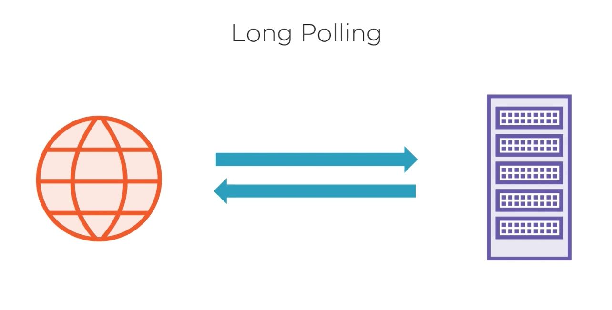
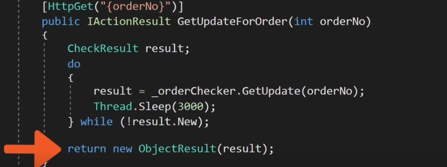
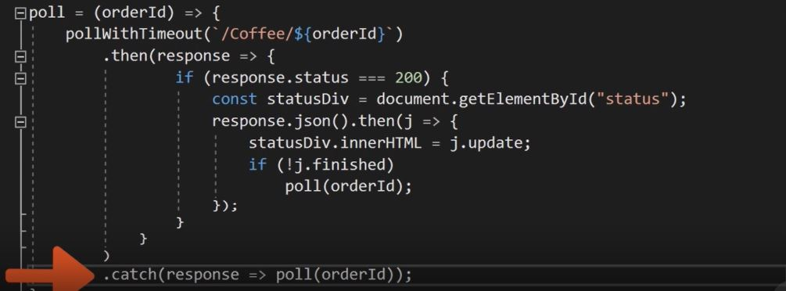

# AspCoreSignalR

    What are the method we have to call a server update with no post back?
        <ul>
            <li>Polling</li>
            <li>Long Polling</li>
            <li>Server Event</li>
            <li>WebSocket</li>
            <li>*Signal R*</li>
        </ul>
        

            <h3>Polling:</h3>
            In polling there will be multiple call to the server untile we get the result.
                    
            <pre>
                function doPoll(){
                    fetch('http://Sample/getresult', 
                    {
                        method: "POST",
                        body:{product, size};
                    })
                    .then(response = &gt; response.text())
                    .then(id =&gt; intervarId = setInterval(doPoll, 1000, id));
                });
            </pre>
            here untie we get the repy from server we keep on calling the url.
        

        

            <h3>Long Polling</h3>
            We request the server and server will keep open the connection until respond to the request, If there is no response within certain timeframe the request will timeout. If timeout happen browser will start requesting again with new request.
        

        
        
        

